## Todo
- [ ] : PCA elbow plot
- [ ] : functional analysis by celltypes (all)
  - [ ] : some network plots

## Updates
- [x] : s3/s4 - detailed mechanisms of same patient different pathology 
- [x] : functional analysis - global function using gprofiler by cluster first (Functional Analysis)(#functional)

## Functional Analysis

### Data sources and processing

- Differential expression input: edgeR results [edger_s3s4_deg](data/s3s4_repairment_DE.csv) filtered for clusters (0, 1, 2, 11, 14, 15, 17)
- Genes ranked by mean gene expression across selected clusters
- Gene sets: MSigDB Hallmark gene sets  [gmt](data/h.all.v2026.1.Hs.symbols.gmt)
- Method: Gene Set Enrichment Analysis using fgseaMultilevel (default parameters; ≥1000 permutations approximation) in fgsea R4.5 package
- Output:  Enrichment results saved as  [result_table](data/gsea_s3s4epi_h.all.tsv)

### Results

Top 20 Differential GO::BP Functions

| barplot | network plot |
|-|-|
| 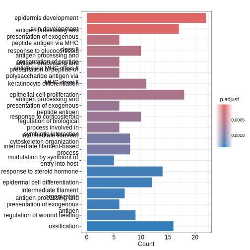 | 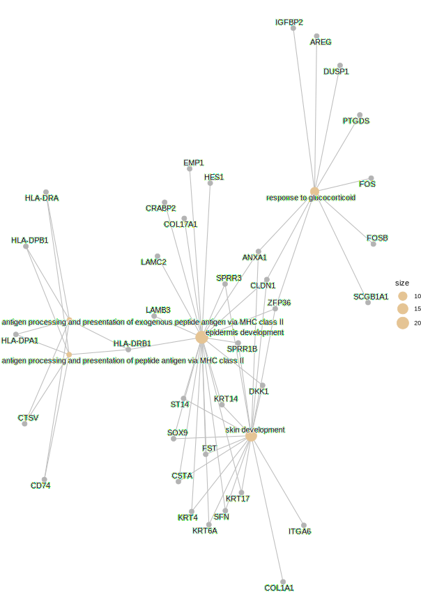|

#### Top MSigDB GSEA Results Using s3 and s4 Epithelial Samples Only

| Updated analysis | Previous analysis |
|-----------------|------------------|
|  |  |

#### Top MSigDB GSEA Results Using all (s1-s13) Epithelial Samples 

| Sig. Pathways | Pathways selected from the s3s4 Results |  
| :-: | :-: |
|  |   |
>These results reveal distinct pathway alterations associated with the repair process. Notably, pathways that are significant in the s3–s4 subset show reduced significance or altered directionality when evaluated across all samples (s1–s13).


### Interpretation
- The new analysis with proper batch correction and cluster iddntification repfoduced the similar results

## QC

Cells were filtered using thresholds of >500 UMIs, >200 detected genes, and mitochondrial content ≤25%. QC metrics are shown per sample in Fig. 1A.
* Mitochondria Proportions ( MT > 25% )
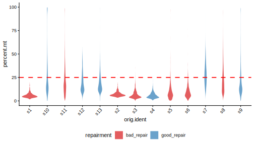

* nCounts vs nFeatures ( nFeatures > 200 )


## Integration

To mitigate batch effects across samples, we applied canonical correlation analysis (CCA)–based integration using Seurat v5. This approach identifies shared transcriptional structures across datasets and aligns cells into a common embedding while preserving biological heterogeneity. The resulting integrated representation (`integrated.cca`) was used for downstream clustering and visualization.

| Before | After | 
| :-: | :-: |
|  |  |

## Clustering 

Resolution was selected using a composite metric integrating cluster stability (ARI), sample mixing (LISI), entropy, and minimum cluster size constraints.


---

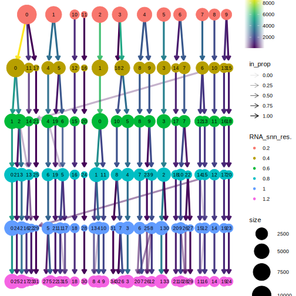

---

Resolution evaluation summary

| resolution | n_clusters | mean_lisi | mean_entropy | min_cluster_size |
|------------|------------|-----------|--------------|------------------|
| 0.2        | 12         | 4.393888  | 1.915863     | 136              |
| 0.4        | 19         | 4.133513  | 1.804466     | 76               |
| 0.6        | 22         | 4.407481  | 1.893463     | 104              |
| 0.8        | 26         | 4.411981  | 1.866129     | 104              |
| 1.0        | 32         | 4.296710  | 1.803040     | 76               |
| 1.2        | 35         | 4.298096  | 1.805409     | 77               |

---

Resolution selection criteria: Resolution was selected based on the following principles:
- LISI is near its maximum (optimal batch mixing)  
- Entropy does not decrease substantially  
- Minimum cluster size does not collapse  
- Chosen before rapid acceleration in cluster number  

Based on these criteria, resolutions **0.6–0.8** represent the optimal trade-off between stability, biological resolution, and robustness.

  [pdf](figures/umap_cluster.pdf)
  [pdf](figures/umap_celltype.pdf)

-- 

## Cluster proportion modeling
### Methods
We modeled cluster-level cell proportions using a Dirichlet-multinomial mixed-effects model (sccomp), including repairment, dysplasia, 
and their interaction (repairment*dysplasia) as fixed effects, with patient as a random intercept (1 | patient).
Cluster-specific composition effects (c_effect) and corresponding 95% credible intervals (c_lower, c_upper) were estimated without variational inference. Statistical significance was defined at a false discovery rate (FDR) < 0.05 based on posterior hypothesis testing (pH0).
This framework jointly captures inter-patient heterogeneity and the effects of repairment and dysplasia on cluster composition, while accounting for repeated measurements within patients.

### Results
Canonically, good repair is associated with non-dysplastic states, while dysplasia is linked to impaired repair. 
Patient composition varied across clusters, with certain clusters exhibiting bias toward repairment or dysplasia states.
In this context, Cluster 4 displays a non-canonical pattern, being enriched under both good repair and dysplasia, whereas Cluster 3 follows the expected canonical trend with reduced abundance under good repair.


| Cluster | Factor Effect                  | Interpretation                                      |
|--------|-------------------------------|----------------------------------------------------|
| 3      | ↓ repairment                  | Canonical: reduced under good repair               |
| 4      | ↑ repairment; ↑ dysplasia     | Non-canonical: enriched in both good repair and dysplasia |
| 6      | ↑ dysplasia                   | Consistent with dysplasia-associated enrichment    |

| Repariment Effect | Dysplasia Effect |
| --- | --- |
| 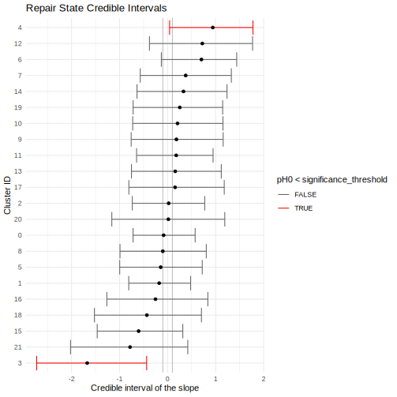 |  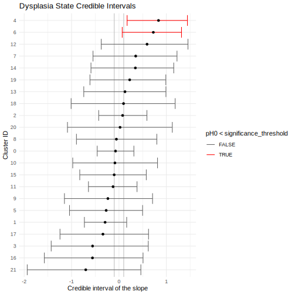 |
> Figure X: Cluster-level compositional changes. Bars indicate posterior mean effects of repairment and dysplasia per cluster. 
> Error bars show 95% credible intervals. Clusters with significant probability of null hypothesis (pH0) < 0.05 are highlighted. 

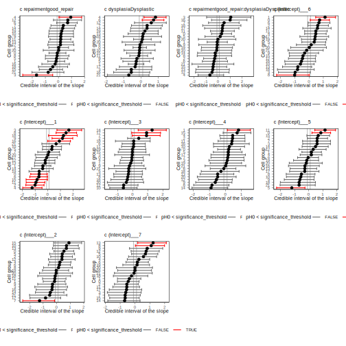
> Figure X: Cluster-level compositional changes of all parameters. Intercept indicates patient id.

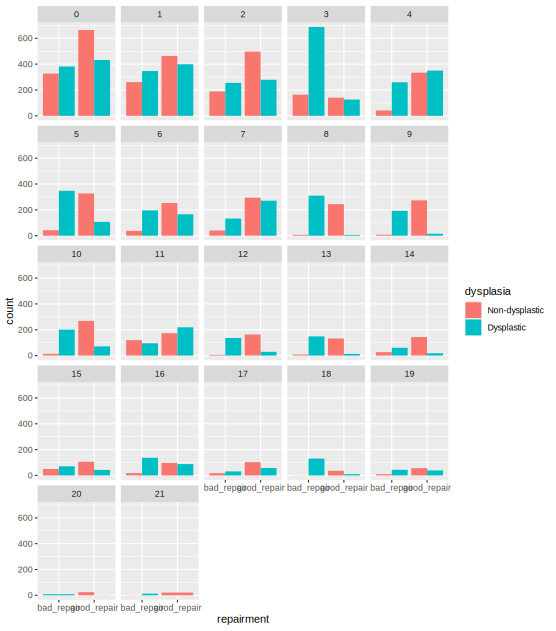
> Figure X. Repairment and dysplasia populations. The apparent non-canonical enrichment of Cluster 4 (bad-repair, dysplastic) is largely attributable to the disproportionately high number of dysplastic cells in the good-repair sample s4 (n = 340), which skews the cluster composition. 
However, this apparent reverse correlation is not statistically significant (no significant interaction term), highlighting the non-canonical features of sample s3—which is why we examine s3 and s4 in more detail.


--
## Celltype Identification

### Pan-Human Azimuth

Cell type annotation was performed using Pan-Human Azimuth implemented in Seurat ([PMID: 34062119](https://pubmed.ncbi.nlm.nih.gov/34062119/);[PMID: 31178118](https://pubmed.ncbi.nlm.nih.gov/31178118/)).

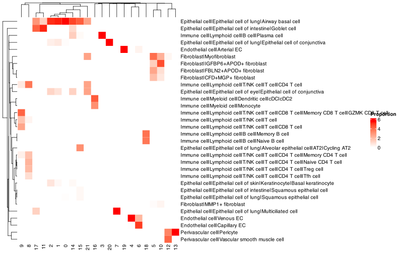

### Manual Identification

Old markers

| Celltype Score | Marker Gene Expression |
| :-: | :-: |
|  | 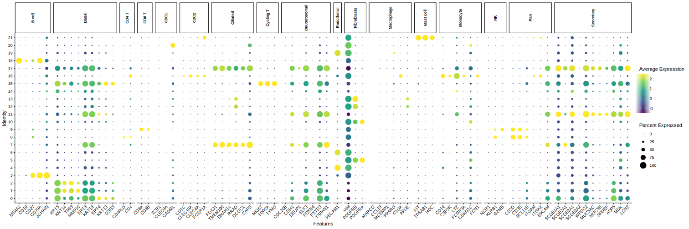 |

New markers
 
[pdf](figures/dotplot_moumita_markers.pdf) 


## Target Vln Plots

 [pdf](figures/vln_target.pdf)
 [pdf](figures/vln_target_s3s4.pdf)
 [pdf](figures/vln_target_s3s4_epi.pdf)


## S3 and S4

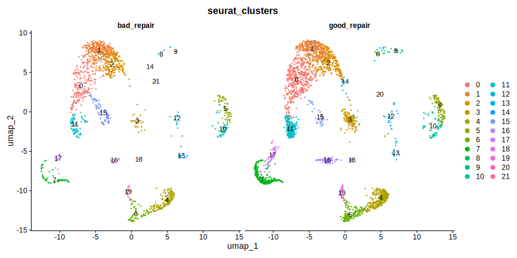 [pdf](figures/umap_s3s4.pdf)
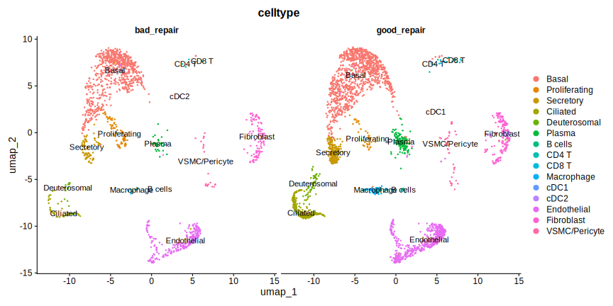 [pdf](figures/umap_s3s4_celltype.pdf)

```
    bad_repair(s3) good_repair(s4)
  0         208         432 *basal-epithelial
  1         313         399
  2         228         279
  3          29         126 *B-cell
  4         176         350 *endothelial
  5          60         107 *fibroblast
  6          69         166 *endothelial
  7          55         271
  8           3           6
  9           2          15
  10         43          71
  11         78         219
  12         12          29
  13         11          13
  14          4          18
  15         91          43 *MKI67 vs CDKN1A 
  16         11          88
  17         15          58 *Cilliated 
  18          1          10
  19         20          39
  20          0           1
  21          2           0
```
            
### Differential Genes 
Repair-associated genes were identified using edgeR under the criteria of false discovery rate (FDR) < 0.01, absolute log2 fold change (|log2FC|) > 1, and a minimum expression proportion (≥20%) in both groups. The complete differential expression results are available in [edger results](data/s3s4_repairment_DE.csv).

Core repair genes were subsequently defined as genes that were significantly differentially expressed across at least two clusters.

**Repair-associated top-200 genes**

Selected with FDR < 0.01, max(pct) > 0.5 (majority expression in ≥1 group), and |logFC| > 1.5 in at least one epithelial cluster.

 [pdf](figures/heatmap_core_genes_epionly.pdf)
[selected edgeR results](data/s3s4_repairment_DE_core_epi.csv)

**Previsou Repair-associated genes**


